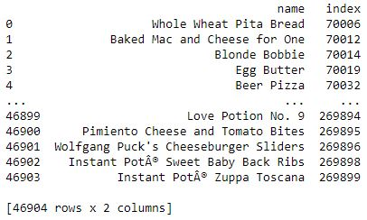
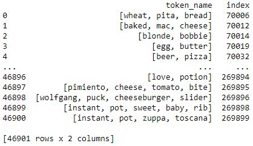
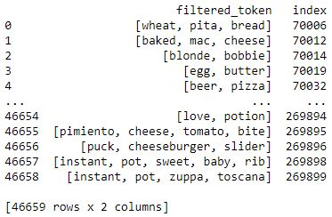
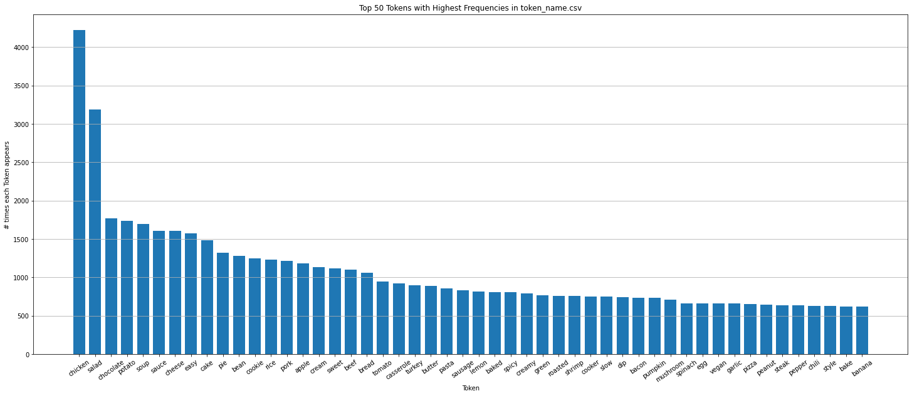
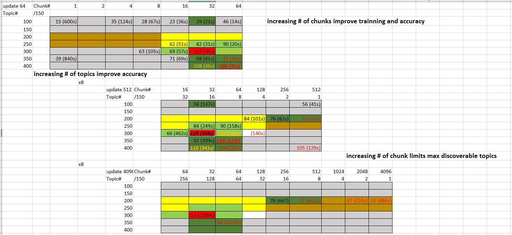
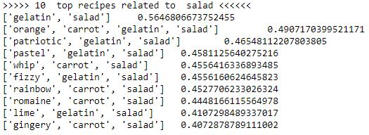
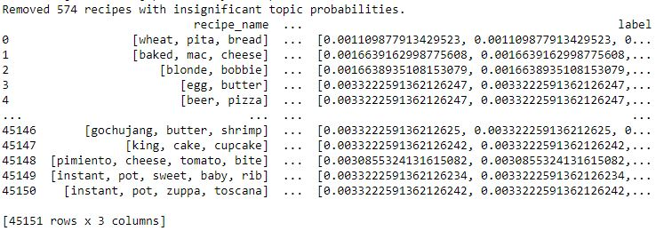

# REScipe (Data Processing)
## Table of Contents
* [Introduction](#Introduction)
* [Language](#language)
* [Examples of Use](#examples-of-use)
* [Project Status](#project-status)
## Introduction
REScipe is a project for recipe recommendation given an image of food/dishes. The project has two parts, data processing and neural network training. This repo contains most of the data processing part, including tokenization, data cleaning, LDA model training, hyperparameter search, and label generation.

This part of the project aims to generate lower-dimensional labels for more than 40 thousand recipes given their recipe names (crawled from `allrecipe.com`). Since each recipe name is unique, it is necessary to extract common features as labels to make the training of the classification model practical. This program takes an XML spreadsheet of recipes, and outputs a trained LDA model that can be used to generate reasonably small labels for most recipes.
## Language
* Python 3.7
* Libraries:
   * `Pandas`
   * `NumPy`
   * `SpaCy`, with the trained language model `en_core_web_sm` for tokenization
   * `Gensim` for LDA model training
   * `inflect` for plural-to-singular lemmatization
   * `Matplotlib`
## Examples of Use
1. Load the XML spreadsheet into data frame

2. Tokenization and lemmatization

3. Filtering after tokenization

* The 50 most common tokens in the corpus

4. Training LDA model, using the corpus (Hyperparameter Tuning)

5. Validation of the LDA model

6. Label Generation

## Project Status
This part of the project can be run independently given a structured XML spreadsheet. The entire project has been completed and recorded:

The other part of the project is [REScipe-NeuralNet](https://github.com/JackyChen2T2/REScipe-NeuralNet).

Adjustment to file directories and hyperparameters is necessary when working with a new XML spreadsheets. Depending on the setting, the LDA model training process can take from seconds to half an hour. The `LDA_hyperparameter_tuning.xlsx` file can be used for reference (in the Google Colab environment).
